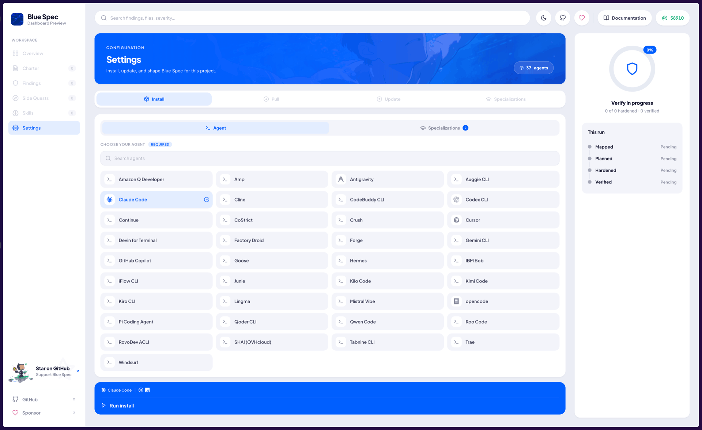
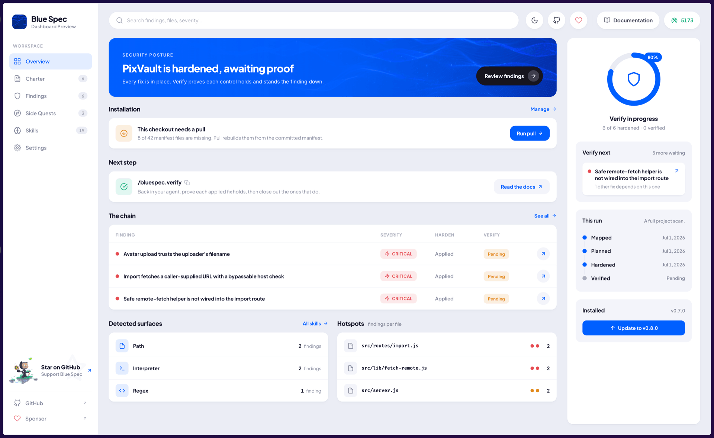
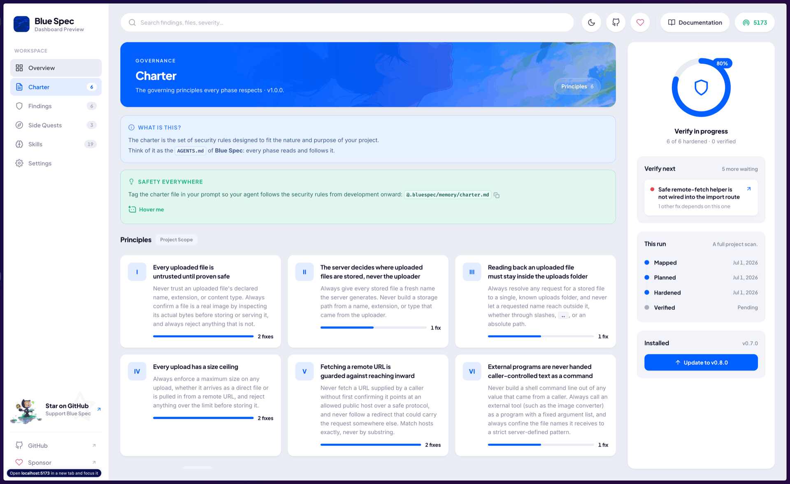
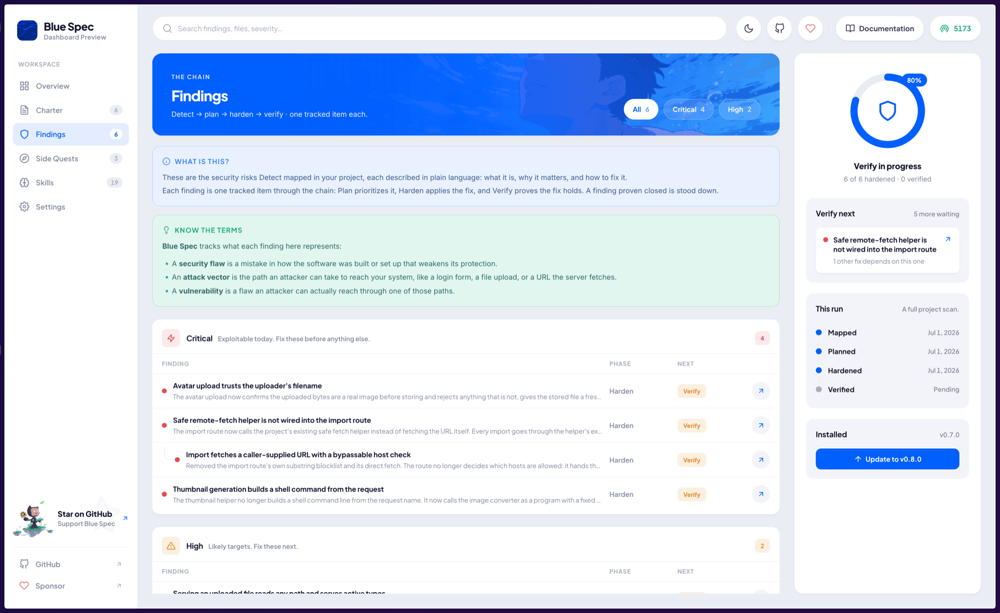
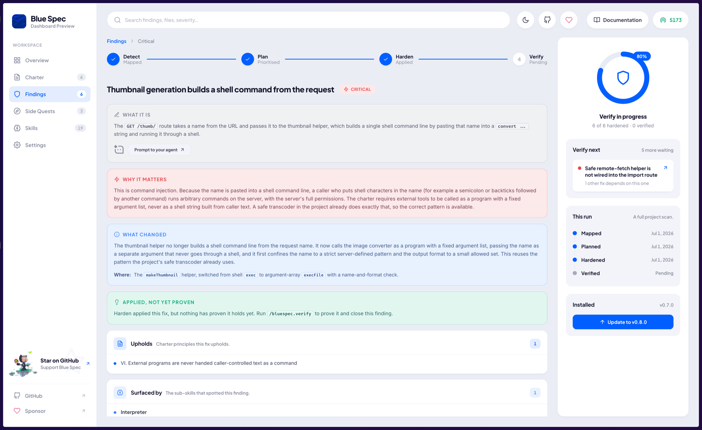
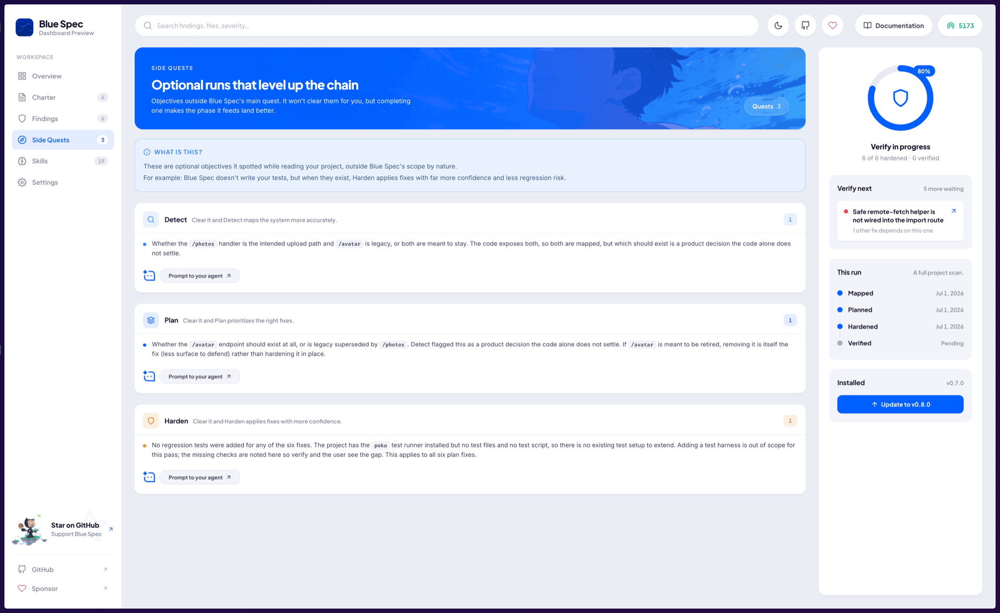

# 🌊 Lagune | [**lagune.ai**](https://lagune.ai)

[](https://www.npmjs.com/package/lagune)
[](https://lagune.ai/docs)
[](https://lagune.ai/docs/supported-agents)

**Lagune** helps your AI agent make a project more secure. You point it at your code, and the agent figures out what your system actually does, then guides you through the security work that matters for it.

- **Lagune** works with projects in **any programming language** and supports [**66 agents**](https://lagune.ai/docs/supported-agents) ✨

---

Love **Lagune**? [**Give us a ⭐ on GitHub**](https://github.com/wellwelwel/lagune)!

---

## Table of Contents

- 🌊 [**Get Started**](#get-started)
  - 📦 [**Dashboard**](#dashboard) | [**CLI**](#cli)
  - 💬 [**Slash Commands**](#slash-commands)
- 💽 [**Requirements**](#requirements)
- 🔐 [**Security**](#security)
- 🖖 [**Acknowledgements**](#acknowledgements)
- 🧑‍⚖️ [**License**](#license)
- 📊 [**Comparison**](#comparison)

---

## Get Started

**Lagune** adapts to your environment, whether it is a new project or an existing one.

> [!TIP]
>
> No API keys are needed, it runs directly through your own agent [(**Claude**, **Codex**, and more)](https://lagune.ai/docs/supported-agents).

---

### Dashboard

For an interactive live view, follow-up, and maintenance, run:

```bash
npx -y lagune@latest
```

It serves a dashboard and opens it in a random port:

- [x] **Live Reload**
- [x] **Private** and **Local**
- [x] **Install**, **Pull**, **Update**, and **Manage** all **Lagune** features directly from your browser
- [x] No `node_modules` or `package.json` is needed 📦

> 
> 
> 
> 
> 
> 

> [!TIP]
>
> - 🚪 Use `--port` or `-p` to specify a custom port.
> - ⏏️ Press `Ctrl+C` to stop.

---

### CLI

#### › Install

```bash
npx -y lagune@latest init
```

- 🃏 **Lagune** runs on **Node.js** under the hood, you use whatever language you want.

#### › Update

To update **Lagune**'s own files and its commands to their latest versions, run:

```bash
npx -y lagune@latest update
```

> [!TIP]
>
> Your charter, the phase artifacts, and any custom specializations stay untouched.

#### › Pull

When you clone or fork a project that already has **Lagune**, run pull to install its files from the manifest:

```bash
npx -y lagune@latest pull
```

> [!TIP]
>
> 💡 Think of it as the **Lagune** equivalent of `npm i`, `pip install -r requirements.txt`, and the like.

---

### Slash Commands

Once **Lagune** is set up in your project, your **AI** agent unlocks a set of slash commands:

#### › Development flow

Secure the work as you build it, guided by the charter, with no flow to follow:

| Command                                               | What it does for you                                                      |
| ----------------------------------------------------- | ------------------------------------------------------------------------- |
| [**/lagune**](https://lagune.ai/docs/commands/lagune) | Enforces security along with your development, on any prompt, at any time |

- Pull in the on-demand specializations in real time while your agent works.
- Combine it with the [**/lagune.charter**](https://lagune.ai/docs/commands/charter) command to shape every build around your project's own security rules.

#### › The Blue Team flow

These five run in order. Each builds on the previous, so following the list top to bottom is all it takes:

| #   | Command                                                        | What it does for you                                                           |
| --- | -------------------------------------------------------------- | ------------------------------------------------------------------------------ |
| 1   | [**/lagune.charter**](https://lagune.ai/docs/commands/charter) | Sets your project's security rules, proposed for you or shaped by what you say |
| 2   | [**/lagune.detect**](https://lagune.ai/docs/commands/detect)   | Reads your code and maps what your system does and where the risks are         |
| 3   | [**/lagune.plan**](https://lagune.ai/docs/commands/plan)       | Turns what detect found into a defense plan, with a fix for each finding       |
| 4   | [**/lagune.harden**](https://lagune.ai/docs/commands/harden)   | Applies the plan's fixes to your code, safely and one at a time                |
| 5   | [**/lagune.verify**](https://lagune.ai/docs/commands/verify)   | Proves each applied fix holds and closes out the ones that do                  |

#### › Special commands

| Command                                                              | What it does                                                                            |
| -------------------------------------------------------------------- | --------------------------------------------------------------------------------------- |
| [**/lagune.specialize**](https://lagune.ai/docs/commands/specialize) | Specializes **Lagune** in a new security _sub_-skill from articles, exploits, or topics |
| [**/lagune.prove**](https://lagune.ai/docs/commands/prove)           | Turns each detected finding into a runnable proof for responsible disclosure            |

> [!TIP]
>
> Security is not a cost, it is an investment: what you put in upfront, you save many times over in the incidents you never have 🙋🏻‍♂️

> [!IMPORTANT]
>
> See the full [**documentation**](https://lagune.ai/) for usage examples and more.

---

## Requirements

You will need these tools installed on your system:

- [**Node.js (LTS)**](https://nodejs.org/en/download/package-manager)
- At least one of the [**Supported Agents**](https://lagune.ai/docs/supported-agents)

---

## Security

To details, report a vulnerability, and see the supported versions, see the [**Security Policy**](https://github.com/wellwelwel/lagune/blob/main/SECURITY.md).

---

## Contributing

🚧 Coming Soon.

---

## Acknowledgements

### Partners

Partners get an exclusive logo across the repositories and landing pages, plus a spot on a dedicated partners page.

> Help my work grow by [**becoming a partner**](https://lagune.ai/docs?partners) 🖖

### Supporters

Really thanks to everyone who has supported and keeps supporting my work.

[](https://github.com/sponsors/wellwelwel)

> Support my work by [**becoming a sponsor**](https://github.com/sponsors/wellwelwel) too ✨

---

## License

**Lagune** is under the [**MIT License**](https://github.com/wellwelwel/lagune/blob/main/LICENSE).<br />
Copyright © 2026-present [**Weslley Araújo**](https://github.com/wellwelwel) and [**contributors**](https://github.com/wellwelwel/lagune/graphs/contributors).

> [!IMPORTANT]
>
> ### Disclaimer
>
> All product names, trademarks, and registered trademarks mentioned are the property of their respective owners and are used for identification purposes only.

---

## Comparison

Agent-by-agent compatibility across other agent-driven workflow tools: [**OpenSpec**](https://github.com/Fission-AI/OpenSpec) (v1.4.1), [**Spec Kit**](https://github.com/github/spec-kit) (v0.10.x), [**Superpowers**](https://github.com/obra/superpowers) (v6.0.3), and [**Skills.sh**](https://github.com/vercel-labs/skills) (v1.5.16).

| Agent                   | OpenSpec | Spec Kit | Superpowers | Skills.sh | Lagune |
| ----------------------- | :------: | :------: | :---------: | :-------: | :----: |
| Claude Code             |    ✅    |    ✅    |     ✅      |    ✅     |   ✅   |
| Codex (OpenAI)          |    ✅    |    ✅    |     ✅      |    ✅     |   ✅   |
| Cursor                  |    ✅    |    ✅    |     ✅      |    ✅     |   ✅   |
| Gemini CLI              |    ✅    |    ✅    |     ✅      |    ✅     |   ✅   |
| GitHub Copilot          |    ✅    |    ✅    |     ✅      |    ✅     |   ✅   |
| Antigravity             |    ✅    |    ✅    |     ✅      |    ✅     |   ✅   |
| Kimi                    |    ✅    |    ✅    |     ✅      |    ✅     |   ✅   |
| OpenCode                |    ✅    |    ✅    |     ✅      |    ✅     |   ✅   |
| Pi                      |    ✅    |    ✅    |     ✅      |    ✅     |   ✅   |
| Factory Droid           |    ✅    |    ❌    |     ✅      |    ✅     |   ✅   |
| Amazon Q Developer      |    ✅    |    ❌    |     ❌      |    ❌     |   ✅   |
| Amp                     |    ❌    |    ✅    |     ❌      |    ✅     |   ✅   |
| Auggie                  |    ✅    |    ✅    |     ❌      |    ✅     |   ✅   |
| Cline                   |    ✅    |    ✅    |     ❌      |    ✅     |   ✅   |
| CodeBuddy               |    ✅    |    ✅    |     ❌      |    ✅     |   ✅   |
| Continue                |    ✅    |    ❌    |     ❌      |    ✅     |   ✅   |
| CoStrict                |    ✅    |    ❌    |     ❌      |    ❌     |   ✅   |
| Crush                   |    ✅    |    ❌    |     ❌      |    ✅     |   ✅   |
| Devin                   |    ❌    |    ✅    |     ❌      |    ✅     |   ✅   |
| Forge / ForgeCode       |    ✅    |    ✅    |     ❌      |    ✅     |   ✅   |
| Goose                   |    ❌    |    ✅    |     ❌      |    ✅     |   ✅   |
| Hermes                  |    ❌    |    ✅    |     ❌      |    ✅     |   ✅   |
| IBM Bob                 |    ✅    |    ✅    |     ❌      |    ✅     |   ✅   |
| iFlow                   |    ✅    |    ✅    |     ❌      |    ✅     |   ✅   |
| Junie (JetBrains)       |    ✅    |    ✅    |     ❌      |    ✅     |   ✅   |
| Kilo Code               |    ✅    |    ✅    |     ❌      |    ✅     |   ✅   |
| Kiro                    |    ✅    |    ✅    |     ❌      |    ✅     |   ✅   |
| Lingma                  |    ✅    |    ✅    |     ❌      |    ✅     |   ✅   |
| Mistral Vibe            |    ✅    |    ✅    |     ❌      |    ✅     |   ✅   |
| Qoder                   |    ✅    |    ✅    |     ❌      |    ✅     |   ✅   |
| Qwen Code               |    ✅    |    ✅    |     ❌      |    ✅     |   ✅   |
| Roo Code                |    ✅    |    ✅    |     ❌      |    ✅     |   ✅   |
| RovoDev (Atlassian)     |    ❌    |    ✅    |     ❌      |    ✅     |   ✅   |
| SHAI (OVHcloud)         |    ❌    |    ✅    |     ❌      |    ❌     |   ✅   |
| Tabnine CLI             |    ❌    |    ✅    |     ❌      |    ✅     |   ✅   |
| Trae                    |    ✅    |    ✅    |     ❌      |    ✅     |   ✅   |
| Windsurf                |    ✅    |    ✅    |     ❌      |    ✅     |   ✅   |
| AdaL                    |    ❌    |    ❌    |     ❌      |    ✅     |   ✅   |
| AiderDesk               |    ❌    |    ❌    |     ❌      |    ✅     |   ✅   |
| AstrBot                 |    ❌    |    ❌    |     ❌      |    ✅     |   ✅   |
| Autohand Code CLI       |    ❌    |    ❌    |     ❌      |    ✅     |   ✅   |
| CodeArts Agent (Huawei) |    ❌    |    ❌    |     ❌      |    ✅     |   ✅   |
| Codemaker               |    ❌    |    ❌    |     ❌      |    ✅     |   ✅   |
| Code Studio             |    ❌    |    ❌    |     ❌      |    ✅     |   ✅   |
| Command Code            |    ❌    |    ❌    |     ❌      |    ✅     |   ✅   |
| Cortex Code (Snowflake) |    ❌    |    ❌    |     ❌      |    ✅     |   ✅   |
| Deep Agents (LangChain) |    ❌    |    ❌    |     ❌      |    ✅     |   ✅   |
| Dexto                   |    ❌    |    ❌    |     ❌      |    ✅     |   ✅   |
| Eve                     |    ❌    |    ❌    |     ❌      |    ✅     |   ✅   |
| Firebender              |    ❌    |    ❌    |     ❌      |    ✅     |   ❌   |
| inference.sh            |    ❌    |    ❌    |     ❌      |    ✅     |   ✅   |
| Jazz                    |    ❌    |    ❌    |     ❌      |    ✅     |   ✅   |
| Kode                    |    ❌    |    ❌    |     ❌      |    ✅     |   ✅   |
| Loaf                    |    ❌    |    ❌    |     ❌      |    ✅     |   ✅   |
| MCPJam                  |    ❌    |    ❌    |     ❌      |    ✅     |   ✅   |
| Moxby                   |    ❌    |    ❌    |     ❌      |    ✅     |   ✅   |
| Mux                     |    ❌    |    ❌    |     ❌      |    ✅     |   ✅   |
| Neovate                 |    ❌    |    ❌    |     ❌      |    ✅     |   ❌   |
| Ona                     |    ❌    |    ❌    |     ❌      |    ✅     |   ✅   |
| OpenClaw                |    ❌    |    ❌    |     ❌      |    ✅     |   ✅   |
| OpenHands               |    ❌    |    ❌    |     ❌      |    ✅     |   ❌   |
| Pochi                   |    ❌    |    ❌    |     ❌      |    ✅     |   ✅   |
| PromptScript            |    ❌    |    ❌    |     ❌      |    ✅     |   ✅   |
| Reasonix                |    ❌    |    ❌    |     ❌      |    ✅     |   ✅   |
| Replit                  |    ❌    |    ❌    |     ❌      |    ✅     |   ✅   |
| Terramind               |    ❌    |    ❌    |     ❌      |    ✅     |   ✅   |
| Tinycloud               |    ❌    |    ❌    |     ❌      |    ✅     |   ✅   |
| Warp                    |    ❌    |    ❌    |     ❌      |    ✅     |   ✅   |
| Zed                     |    ❌    |    ❌    |     ❌      |    ✅     |   ✅   |
| ZCode                   |    ❌    |    ❌    |     ❌      |    ✅     |   ❌   |
| Zencoder                |    ❌    |    ❌    |     ❌      |    ✅     |   ❌   |
| Zenflow                 |    ❌    |    ❌    |     ❌      |    ✅     |   ❌   |
| **Total**               |  **30**  |  **32**  |   **10**    |  **69**   | **66** |
