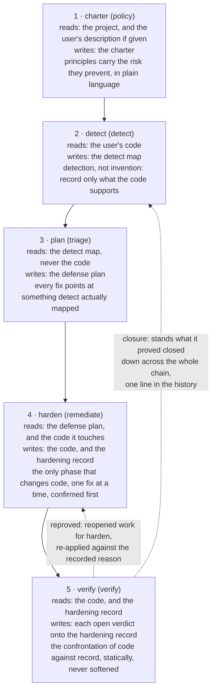
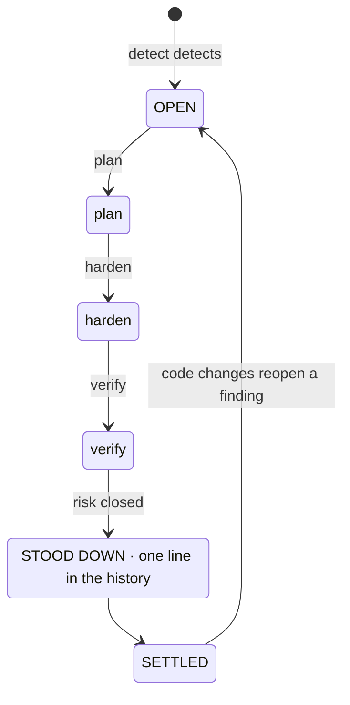
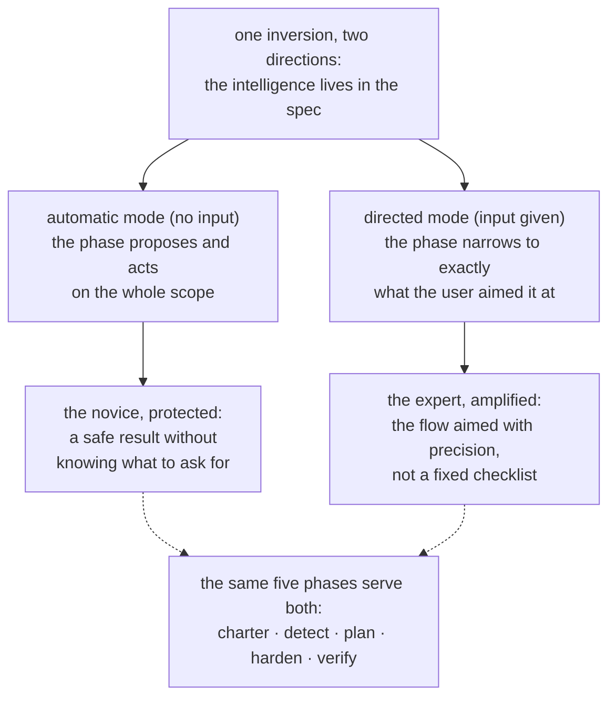
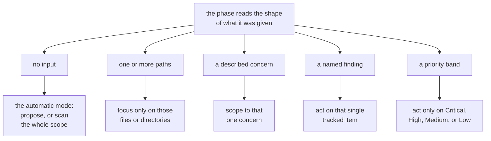
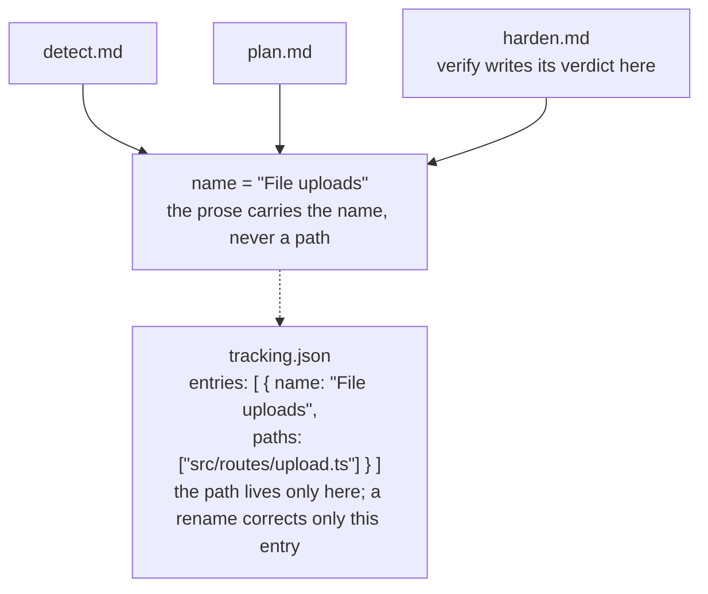
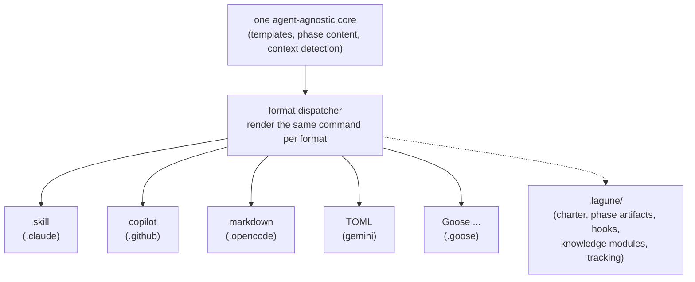
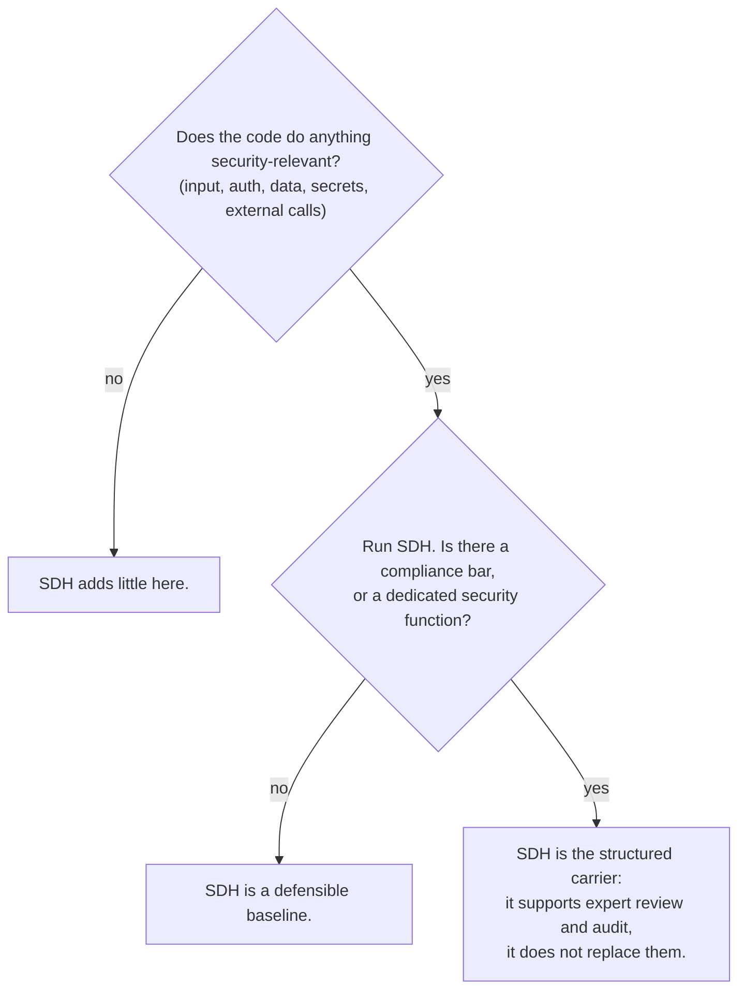

# Security-Driven Hardening (SDH): A Convention for the AI-Assisted Development Age

- **Weslley Araújo**
- **Methodology Paper, 2026.**

---

## Abstract

Security-Driven Hardening (SDH) is a structured, AI-driven, defense-only security methodology for the era in which software is increasingly written by AI agents and by people who are not security specialists. Instead of running a fixed catalog of generic checks, SDH first detects what a system actually does (login, file uploads, payments, data exposure, and so on) and then drives the security work that is specific to that context. It is governed by safe-by-default principles, framed entirely around defense, and expressed in plain language so that any user can act on it.

This document argues that SDH is a missing convention, not a single tool. The intelligence lives in the methodology, not in the user, which lets it serve a novice and an expert through the same flow. Two properties set it apart from prior spec-first approaches `[1]`. SDH is **state-independent**: it adapts to an empty directory, a project in progress, a single pull request, or a large legacy codebase, in any stack. And SDH is **closable**: a risk verified closed is stood down out of the whole flow, so that finding reaches a settled state and is reopened only when the code changes. SDH does not replace security professionals or specialized Blue Team tooling. It extends the developer's own knowledge, and the more a developer understands security, the more they can drive it.

**Lagune** is the reference implementation. It realizes SDH across 63 AI coding agents and proves the methodology is buildable and portable. SDH is offered as a convention others can adopt.

> **Index Terms**
>
> AI-assisted development, software security, defensive security, spec-driven development, security hardening, agent-driven workflows, closability, context-aware security, on-demand knowledge, agent-agnostic tooling.

---

## I. Introduction: the security gap AI-assisted development opened

Software is increasingly shipped by people, and by AI agents, who cannot reliably recognize an insecure pattern: a leaked secret, a missing authorization check, an injectable query. These are not exotic risks. They sit among the risk classes that dominate real incidents, catalogued for years in public references `[6]`, `[7]`, and recent studies report that a meaningful share of AI-generated code ships with exactly such defects `[8]`. AI coding assistants made this acute by letting non-developers ship real software, but the gap is broader than any single audience. Most projects never get a security pass that is specific to what they actually do. The ecosystem becomes more fragile with every premature "it works, ship it" decision.

Generic security advice does not close this gap. A static checklist is not specific to what a system does, so it floods a small project with irrelevant items and still misses the risk that matters for that one project. The problem is not a shortage of security knowledge in the world. The problem is matching the right knowledge to the system actually in front of the user, and doing it for someone who may not know what to ask for.

SDH answers this with a single inversion: **the intelligence lives in the spec, not in the user**. The methodology detects the context, triages the risks that context carries, and guides the fixes, so a developer and a non-developer are served through the same flow. The findings and recommendations stay in plain language, so they are actionable regardless of the reader's technical depth. The expert is not constrained by this, but amplified by it, a duality we develop in `§VI`.

> **Key Insight**
>
> **The core inversion:** The intelligence lives in the spec, not in the user. The methodology learns what the system does and matches the security work to it, so the user is never required to know what to ask for.

Consider a developer who tells an AI assistant, "my app lets users upload a profile picture." Without a security pass, the assistant produces working code that quietly trusts whatever the client sends: the declared file type, the file name, the size. The upload ships, and a file disguised as an image can carry code, a crafted name can break out of the storage path, an oversized file can exhaust the server. None of this is visible in a demo, so it ships.

The same code run through SDH behaves differently. It detects that the system accepts files from outside (detect), triages that into the risks an upload carries (triage), proposes checking the real file type and size, renaming on save, and storing where code cannot run (remediate), then reads the result and confirms each control actually holds (verify). The developer never had to know the phrase "unrestricted file upload." The methodology supplied it on their behalf.

This document makes the following contributions:

- A precise definition of SDH as a methodology, independent of any one implementation, with its design principles (`§III`).
- A five-phase defensive lifecycle in which the separation of duties is itself the contribution: detection never invents, planning never reads code, only one phase changes code, and verification never softens its judgment (`§IV`).
- **Closability** as a methodological stance: an individual finding has an end state, not an endless loop (`§V`).
- The **dev-knowledge-extender** duality: one flow that protects the novice and amplifies the expert (`§VI`).
- **Non-invocable knowledge modules and prompt-on-demand**: focused security knowledge the agent loads only when the project's context calls for it, never by default (`§VII`).
- **State-independence** and **non-authoritative adaptivity**: SDH fits any development state and adapts to the scenario instead of imposing a fixed scope (`§VIII`).
- A **preventive mode**: the same defense run while ordinary work is built, so the code lands safe-by-default and the phases have less to correct (`§IX`).
- A dedicated comparison with Spec-Driven Development, the lineage SDH grew from and then diverged from (`§X`).
- The engineering disciplines that make the methodology hold under refactors and across agents: identity-by-name tracking (`§XI`) and an agent-agnostic carrier (`§XII`).

---

## II. Background and related work

SDH builds on prior work. It inherits a proven structure from spec-first, agent-driven development `[1]`, `[2]`, `[3]`: scaffolded templates, slash commands an agent consumes, a governing document, and an agent that runs the phases. It reimplements that structure with a defensive purpose. The lineage is deliberate, and one of SDH's working principles names it directly: build the workflow from a proven structure, then frame it for security.

SDH is not a static catalog of generic recommendations. A catalog knows a great deal about security in general and nothing about the project in front of it. SDH reverses that emphasis. It spends its first effort on detection, on learning what the system does, and only then reaches for the knowledge that detection makes relevant.

SDH is also not a replacement for security people or for specialized Blue Team tooling. It is an extender of the developer's knowledge (`§VI`). A team with a dedicated security function should keep it. SDH gives that team a structured carrier, and it gives a team without one a defensible baseline.

SDH also sits next to deterministic security scanners (static analysis, linters) `[4]`, `[5]`. Those tools are valuable precisely because they are deterministic and repeatable. SDH is mostly agent-reasoned, which trades strict determinism for context-awareness. The methodology does not pretend otherwise. Where determinism matters, it embeds a deterministic engine inside the reasoning (`§VII`): the agent decides whether an input is worth checking, and a deterministic program decides whether that input is dangerous.

The most direct prior art is Spec-Driven Development (SDD), the family of spec-first methodologies that drives a build forward from an executable specification. We treat SDD as a class. Its clearest statement as a practitioner methodology is Piskala's report `[1]`, and its most visible agent-driven toolkit is GitHub's Spec Kit `[2]`, with OpenSpec `[3]` as a second tool from the same family. These name the canonical references for the comparison in `§X`.

---

## III. SDH: definition and design principles

**Security-Driven Hardening** is a structured, AI-driven security methodology that turns a codebase into a more secure one by driving the work from a spec the agent runs, rather than from ad-hoc fixes. The name is inspired by **Blue Teams**, the defenders in security. SDH is about defense, hardening, and verification, never offense.

> **Definition**
>
> **Security-Driven Hardening (SDH):** A structured, AI-driven, defense-only security methodology that first detects what a system actually does, then drives the context-specific security work, governed by safe-by-default principles and expressed in plain language.

SDH is defined by a set of binding principles. Each one is a rule, and each one confers a specific guarantee on the user.

| Principle                                                | The rule                                                                                                                                        | What it guarantees the user                                                                                                                      |
| -------------------------------------------------------- | ----------------------------------------------------------------------------------------------------------------------------------------------- | ------------------------------------------------------------------------------------------------------------------------------------------------ |
| Safe-by-default, in plain language, for everyone equally | Every default, message, and fix is safe out of the box and intelligible to any reader, developer or not. No user tier is privileged.            | A novice receives a safe baseline without asking for it, and reads the result in their own terms.                                                |
| Context-aware over generic                               | Every phase starts from the context detected in detect, and acts on what the system actually does.                                              | Recommendations fit the project, not a checklist. The intelligence is in the spec, not the user.                                                 |
| Flexible over rigid                                      | Principles, requirements, and recommendations are starting points. The user can reword, drop, add, or scope anything down.                      | The methodology bends to the project and the user, and never harder than the user wants. Flexibility never weakens the safe-by-default baseline. |
| Reconcile, never append-only                             | Artifacts are living documents, not logs. Each run re-checks every entry: keep what holds, rewrite what changed, remove what no longer applies. | The record always reflects the present, so it never decays into a stale backlog.                                                                 |
| Defense only                                             | SDH audits, hardens, and verifies. It never produces offensive tooling, exploits for malicious use, or detection-evasion for harm.              | The methodology cannot be turned into a weapon. Dual-use content appears only in a clearly defensive framing.                                    |
| Spec-first, agent-driven, framed for security            | The workflow is built from templates, commands, a governing charter, and an agent that runs the phases.                                         | A proven development structure, repurposed so the agent performs the substantive security work.                                                  |

**Table 1.** SDH's design principles and the guarantee each one confers on the user.

These principles are not ornamental. They are the constraints every phase below must respect, and the discussion in `§XV` returns to them to mark the methodology's limits.

The rest of the document develops nine named pillars. They are the parts a reader should be able to keep in mind, and the parts another team would reimplement to claim they are doing SDH.

| Pillar                                              | What it provides                                                                                 | Section     |
| --------------------------------------------------- | ------------------------------------------------------------------------------------------------ | ----------- |
| The context-aware inversion                         | The intelligence is in the spec, not the user, so a novice and an expert share one flow.         | `§I`, `§VI` |
| The five-phase defensive lifecycle                  | Separation of duties: policy, detect, triage, remediate, verify, each with one job.              | `§IV`       |
| Closability                                         | A finding has an end state, not an endless loop. Closed work is stood down.                      | `§V`        |
| The dev-knowledge-extender duality                  | One flow that protects the novice and amplifies the expert, never replacing either.              | `§VI`       |
| Prompt-on-demand, non-invocable knowledge           | Relevant security knowledge is loaded for what the project is, never by default.                 | `§VII`      |
| State-independence and non-authoritative adaptivity | Fits any development state in any stack, and adapts to the scenario instead of imposing a scope. | `§VIII`     |
| The preventive mode                                 | The same defense runs while new work is built, so the code lands safe-by-default.                | `§IX`       |
| Identity-by-name tracking                           | A finding stays one item across phases, and a rename breaks the link in one place.               | `§XI`       |
| The agent-agnostic carrier                          | The security value is written once and runs across agents and stacks.                            | `§XII`      |

**Table 2.** The nine named pillars of SDH and where each is developed.

---

## IV. The 5-phase Blue Team flow

SDH structures the work as a five-phase defensive lifecycle (Figure 1). Each phase is framed around defense, each builds on the previous, and the phases follow real Blue Team activity: establish policy, detect, triage, remediate, verify.



**Figure 1.** The five-phase flow: what each phase reads, what it writes, and its load-bearing invariant. Verify drives both returns: a reproved control reopens harden, and a proven-closed finding is stood down across the chain, one line in the history.

The separation of duties is the contribution. Because each phase has one job, a failure mode is contained to one place, and the reader can trust what each artifact claims.

> **Key Insight**
>
> **Applied is not verified:** Harden records that a fix was applied. Verify verifies it by confronting the code against that record, and the verdict is never softened to match the record. A control can be present in the code and still leave the risk reachable, and then the honest verdict is "risk not closed."

### charter (policy)

The charter establishes the project's security principles, the rules every later phase must respect. It is the governing layer, a kind of compile-time check for the project's security posture. Each principle has a clear name, a non-negotiable rule that can be checked against the code, and a `Why:` line stating the risk it prevents, not just the fix. The charter always reads the project itself (its manifests, structure, and dependencies), and a user's description, when given, is direction the reading then broadens beyond what the user named. With no description, the project is the only source. The two add up rather than compete, and the charter records the policy the project should hold to, not the state of its code. A non-developer should be able to read it and understand both the rule and the risk.

### detect (detect)

Detect reads the code and maps what the system actually does that carries security weight. The governing instruction is "detection, not invention": record only what the code supports, with the evidence later phases need. Detect is neutral. It does not force its findings to fit the charter, because matching risks against the charter's rules is the plan phase's job. Each finding carries three parts: what it is (plain-language description), why it matters (the risk, not just the fact), and the evidence (the function or route where it lives). The evidence carries no file path. The path lives only in the tracking map (`§XI`), so the prose never holds a path that can go stale.

### plan (triage)

Plan turns each finding into a fix, named by its risk class (citing the established catalogs, CWE and OWASP, where they ground it) and tied to the charter principle the fix upholds. The priority (Critical, High, Medium, Low) is not a free choice: plan rates each finding with the CVSS v4.0 Base-and-Environmental method, so the band is the score in plain words, justified by one plain-language line of exposure and stakes, and two runs land the same order. The vector is the precise anchor for an expert, the band and its justification the same rating anyone can follow. Plan works only from the detect map and never reads the code. This is a deliberate constraint, not a limitation: it forces every fix to point at something detect actually detected. If a scope was never mapped, plan stops and routes the user back to detect rather than guessing.

### harden (remediate)

Harden is the only phase that changes code, so it proceeds with caution. It lists the fixes it is about to apply and asks the user to confirm before touching anything, and the user can leave any fix out. It then applies one fix at a time, dependencies first, then highest priority, so each change stays small, reviewable, and easy to undo. It never weakens an existing control to make a new fix fit, and it never breaks a charter principle. If a fix would conflict with a principle, harden stops and surfaces the conflict instead of applying it. Each block is recorded as Applied, Partial, or Blocked. "Applied does not mean verified yet", which is the concern the next phase addresses.

### verify (verify)

Verify verifies each applied control by reading the code and confronting it with what harden recorded. The verification is that confrontation, code against record, and it is static: it confirms a control is present and correct in the code, not that the control holds under attack on a running system. That runtime check, the kind that executes real or simulated attacks against the live system, is out of scope by design. Verify returns one of three verdicts: risk closed, risk not closed, or cannot tell from the code. It produces no artifact of its own: harden and verify share the hardening record, harden owning what was done and verify owning the verdict and its reason, and neither ever writes the other's fields. A reproved control is reopened work for harden, whose next run treats the verdict as overriding its own reading of the code and re-applies against the exact gap the reason names. Verify trusts the code over the record, because a record can claim more than the code delivers. It is read-only on the user's code, and it never softens a verdict to match the record. A control can be present and still leave the risk reachable another way, and in that case the honest verdict is "risk not closed." If, while reading, verify notices a security problem the detect map never covered, it does not invent a verdict for it, since detection is detect's job: it surfaces the problem and routes the user back to detect, so the finding enters through the same flow rather than bypassing it.

> **Worked thread: file uploads.** A single finding shows the spine end to end.
>
> - **detect** finds it: the system accepts files from users, and the upload handler trusts the MIME type the client sends without checking the file's real type. _Why it matters:_ a file disguised as an image can hide malicious code.
> - **plan** decides the fix, priority **Critical**, upholding the principle "All input is untrusted until validated": check the file's real type and size, rename it on save, and store uploads where they cannot be run as code.
> - **harden** applies it, status **Applied**: the handler now detects the real type from content, enforces a size limit, rejects anything unexpected, renames on save, and stores where code cannot run.
> - **verify** reads the handler, confronts it with the record, and returns **risk closed**: the code does exactly what the record claims.
>
> The same finding name carries through the detect map, the plan, and the hardening record, and verify acts on that record under the same name: an open verdict is written onto the finding's block, and a proven-closed finding is stood down (`§V`). That shared name is its identity (`§XI`).

---

## V. Closability: a finding has an end state

Most security tooling leaves the user with a backlog that only grows. SDH adopts a different position: **a finding is closable, so it has an end state instead of living in an endless backlog** (Figure 2). This follows directly from the reconcile principle.

> **Definition**
>
> **Closability:** A risk verified closed is stood down out of the whole flow, so that finding reaches a settled state and is reopened only when the code changes. A finding has an end state, even though the security program itself stays continuous.

SDH artifacts are living documents, not logs. Every time a phase re-runs, it re-checks each existing entry against the current truth and does one of three things: keeps what still holds, rewrites what changed, or removes what no longer applies. A finding the code shows is now resolved is simply removed. The working record reflects the present, not the past.

Closure is that same reconcile reaching its conclusion. When verify verifies a risk closed, it stands the finding down across the whole flow, the detect map, the plan, the hardening record, and the tracking map. This is why verify is the one phase that writes to the other phases' artifacts: it is the phase that closes the loop. As the finding leaves the chain, standing down distills it into a short entry in a history record that lives outside the working chain and is never reprocessed. This is the line between disappearing and closing: a finding reconcile removed because it stopped being true leaves nothing behind, while a finding proven closed earns its line in the history. A finding stood down is absent from every working artifact afterward, and that absence is expected, not a broken chain.



**Figure 2.** The closability state machine. A finding moves OPEN → STOOD DOWN → SETTLED, and reopens only when the code changes.

When everything in scope is stood down, the cycle is settled, and the settled state has a concrete form: an artifact whose last finding closed is removed whole, so a fully closed chain leaves only the charter and the history, the policy and the proof. The cycle is reopened only when the code changes. The methodology gives each finding a definite end, which is exactly what an endless backlog cannot.

---

## VI. The dev-knowledge-extender duality

SDH does not replace people, and it does not replace specialized Blue Team tooling. It **extends the developer's own knowledge**. The more a developer understands security, the more precisely they can drive the flow, and the more autonomy they have. A developer who understands little still receives a safe result, because the automatic mode safeguards them.

The inversion from `§I`, the intelligence lives in the spec, applies in both directions. For the novice, it is protection: they do not need to know what to ask for, because the spec proposes. For the expert, it is amplification: the same spec lets them aim the flow with precision instead of working against a fixed checklist.

Every phase carries this duality in its own operation (Figure 3). Run with no input, it acts on the whole scope on the user's behalf. Given direction, the same phase narrows to exactly what the user aimed it at.



**Figure 3.** The dev-knowledge-extender duality. One inversion serves two audiences: the automatic mode protects the novice, and the directed mode amplifies the expert, through the same five phases.

The on-demand knowledge modules (`§VII`) make the duality explicit in their own text. Each one tells the agent that its knowledge "extends your judgment" and to keep reasoning beyond what the module provides. The knowledge is a floor, not a ceiling. This is what serves both audiences in the document's intended balance: the developer community gains a substantial instrument, and the Blue Team practitioner gains a structured carrier that does not pretend to do their job for them.

---

## VII. Non-invocable knowledge modules and prompt-on-demand

This is the methodology's most novel pattern. SDH carries focused security knowledge as modules that load **only on demand**, and the agent itself decides which to load by matching the project's context. We call this **prompt-on-demand**: a way for the agent to choose which knowledge to activate based on the scope of the project it is in, instead of running every check by default. The modules are evolutionary, and any one of them can change or be replaced at any time. The contribution is the pattern, not the modules themselves.

> **Definition**
>
> **Prompt-on-demand:** The agent selects which security knowledge to activate by matching it against the scope of the project in front of it, so the relevant knowledge is pulled in for what the project actually is, instead of every check running by default.

> **Definition**
>
> **Non-invocable knowledge module:** A focused, language-agnostic unit of security knowledge for one risk area. It audits and explains, never rewrites code, and never produces an attack input. Nothing opens it directly: a single dispatcher loads it only when the project's context calls for it.

A knowledge module is focused, language-agnostic security knowledge for one risk area. It audits and explains. It never rewrites the user's code, and it never produces an attack input. Each module names the safer shapes for the risks it covers and tells the agent how to act on a finding in each phase that consumes it: how to judge it at detection, how to apply its fix safely at remediation, and how to prove it at verification. The modules are evolutionary by design: the collection grows and reshapes over time, while the pattern around it stays the same. This section describes that pattern, not any particular module.

The defining trait is that a module is **non-invocable on its own**. Nothing opens it directly, not the user, not a phase. There is a single dispatcher entry point: the detection phase lists the catalog once, matches the project's context against what each entry covers, and loads only the modules whose area is present in scope. The later phases reuse that matched list instead of re-listing, so one match serves the whole chain. A module whose context is absent is skipped, and the skip is as accountable as the load: every entry in the catalog receives an explicit verdict, applied or skipped with the reason read off the code, so a vague sense of irrelevance never stands in for absence. Finding none applicable is a valid outcome.

The catalog is data, and growth is one knowledge file plus one catalog row, never a new command. This is the same context-aware principle as the phases, applied to knowledge: the relevant knowledge is pulled in for what the project actually is, instead of every check running by default. The same property lets the user, not only the maintainer, grow the catalog: a security source or topic the user supplies is distilled into a new module, written into the project's own catalog and loaded thereafter exactly like a built-in. Authoring a module is itself defense-only and obeys the same boundary the modules enforce: an attack write-up may be the source, but the module it yields audits and explains, it never emits a working exploit. So the inversion of `§I`, the intelligence living in the spec, extends to the catalog itself, which the user can deepen for their own context without writing code.

A short dispatch example illustrates prompt-on-demand. Detect reads a folder of code that runs in the browser. It matches that area in the catalog, loads the module that covers it, and surfaces a client-side finding through detect's normal steps. The modules for areas not present in this scope do not match, so they never load and are never mentioned. The project decided what knowledge was relevant, not a fixed configuration.

Determinism appears precisely where it matters. A module can carry a deterministic checker, not just prose. Where a risk class has a crisp decision procedure, the module ships a small program that returns a fixed verdict for a given input, for example a short set of words such as `safe`, `unsafe`, or `invalid input`. Some risk classes are deterministically decidable in exactly this way, with a body of prior work behind the decision procedure `[9]`, `[10]`, `[11]`. The checker either scores candidates the agent supplies or scans the scope to find them itself, and in both cases the checker, not the agent, returns the verdict. A module universal enough can be marked required in the catalog and is then always applied, its checker run over the whole scope. This is the one case where knowledge loads without a context match, and it is declared in the catalog's data, never decided by the agent in the moment. This is where SDH grounds its agent reasoning in something repeatable, without pretending the whole flow is deterministic.

Finally, the modules are **detachable**. Because the knowledge stands on its own, a user can run one directly in a prompt that has nothing to do with the full SDH flow, keeping security alongside ordinary development. A module with a deterministic checker can, for instance, screen each candidate produced during ordinary coding and keep only the safe ones. This detachability is part of why SDH adapts to so many situations, which is the subject of `§VIII`, and its full expression is the preventive mode (`§IX`), where the same knowledge guards ordinary development end to end.

---

## VIII. State-independence and non-authoritative adaptivity

Two properties separate SDH from rigid spec methodologies.

### State-independence

> **Definition**
>
> **State-independence:** The methodology does not depend on the development state. It fits an empty directory, a project in progress, a single pull request, or a large legacy codebase, in any stack, because it learns the starting point by reading it.

Every phase works the same way whether the project is brand new or already exists. The charter infers principles from whatever code is present. Detect maps whatever code is there, even if there is very little. There is no assumed starting point.

### Non-authoritative adaptivity

> **Definition**
>
> **Non-authoritative adaptivity:** The methodology adapts to the scenario rather than imposing a fixed scope the user must follow. When the user does not know what to say, it reads the environment it was invoked in, generates context, and asks the questions that shape what it does next.

The charter's propose mode is the clearest case: SDH derives a safe-by-default charter by analyzing the project, asking the user only when a gap actually changes the result, then writes it and presents each principle in plain language with the risk it prevents. The charter is a living document the user reworks by re-running, not a contract gated behind an approval prompt, so it never requires the user to know what to ask for.

This adaptivity shows up as a sensitivity to the shape of the input: the same phase reads what it was given and chooses a mode (Figure 4). A file in the prompt, a finding from the list, a worry, a focused mission against a known weak point, or a request for a full brute-force scan: each fits the user's need, because the flow is non-authoritative by design. None of this weakens the safe-by-default baseline. Flexibility shapes how the baseline is applied, it never lowers it.



**Figure 4.** Non-authoritative adaptivity. The same phase reads the shape of its input and chooses a mode, so the scope is always the user's, never imposed.

---

## IX. The universal preventive mode: the same defense while the work is built

SDH carries one complementary mode: ordinary development done with the same defense active while the code is written. The user asks for the work itself, a login page, an upload, an endpoint, and the methodology guards the build as it happens, so the result is safe-by-default the moment it lands rather than after a later hardening pass.

> **Definition**
>
> **The preventive mode:** ordinary development run under SDH's governing layer and knowledge. The charter binds the build, the knowledge modules relevant to what is about to be created load on demand, and the result is confronted against exactly the defense that was used before the work is called done.

The mode reuses each piece the phases already carry, pointed at code that does not exist yet. Context detection turns from the code to the intent: the agent reasons through what it is about to build and the boundaries that work crosses (a login implies credentials, a session, and input from outside), and that reasoning is what the knowledge catalog is matched against. Prompt-on-demand (`§VII`) generalizes here: context can be detected in the plan for code, not only in code that exists. The charter governs as it always does, and a request that would break a principle is surfaced as a conflict, never built. The defense is applied inline, at the moment each part is written, validating at the boundary and reaching for the safe construct the first time, so a working-but-unsafe version never exists to be corrected.

The mode ends the way verify begins. Before the work is called done, the builder confronts its own result with the defense it used: the control must sit on the risk's path, not beside it, it must be complete, and where a module ships a deterministic checker, the checker's verdict stands over the agent's own reading. A gap found here is closed as part of the same piece of work, because finishing the work means finishing it securely.

What the mode refuses is as deliberate as what it does. It builds only what was asked and audits nothing around it: auditing what exists belongs to the phases. It writes no artifact and tracks no finding, because a finding is a risk detected in what exists, and this mode's purpose is that the unsafe version never lands at all. The two directions complete each other: the phases close what is already there (`§V`), and the preventive mode keeps new work from reopening it. A chain at rest stays at rest not because development stopped, but because what is built while it rests is built defended.

---

## X. Security-Driven Hardening versus Spec-Driven Development

Security-Driven Hardening (SDH) grew from the Spec-Driven Development (SDD) base and then diverged sharply. The structural inheritance is real and acknowledged: spec-first, agent-driven, a governing document, and a set of phased commands the agent runs. SDH reuses that structure deliberately. What differs is the purpose, the authority model, the assumed state, and the end condition. We treat SDD as a class, using Piskala's report `[1]` as the canonical statement of the methodology, GitHub's Spec Kit `[2]` as the canonical agent toolkit, and OpenSpec `[3]` as a second tool from the same family.

SDD flips traditional development by making specifications executable: the spec directly generates a working implementation rather than just guiding it `[1]`. Its phase set drives a build forward `[2]` (establish governing principles, specify what to build, plan the tech stack, break the plan into tasks, then implement). Its governing document, a constitution of principles, is the foundational piece the agent must adhere to throughout. That is the heart of the difference. SDD's authority flows from the spec into the build, and the implementation is expected to follow it.

SDH inverts almost every axis of that contract (Table 3).

> **Key Insight**
>
> **The core difference:** SDD's authority flows from the spec into the build, and the implementation is expected to follow it. SDH is non-authoritative and flows the other way, inward from the system's detected context, hardening what is already there.

| Axis                | SDD                                                                                   | SDH                                                                                                            |
| ------------------- | ------------------------------------------------------------------------------------- | -------------------------------------------------------------------------------------------------------------- |
| Goal                | Deliver features. The spec becomes a working implementation.                          | Harden what exists or is being built. Every phase is framed for defense.                                       |
| Authority model     | Authoritative. The spec and constitution confine the build to a scope it must follow. | Non-authoritative. SDH adapts to the scenario, and the user can reword, drop, or scope down.                   |
| State assumption    | A forward build from a specification.                                                 | State-independent: empty directory, project in progress, a single PR, or legacy.                               |
| End condition       | Ends when the feature is built.                                                       | Closable. A finding reaches a settled state, reopened only when the code changes.                              |
| Governing document  | A constitution of principles the agent must adhere to.                                | A charter of risk-framed principles (each carries a `Why:` line), explicitly not a fixed contract.             |
| How knowledge grows | Add a command (or extend the phase set).                                              | Add a non-invocable knowledge module the agent loads on demand: one file plus one catalog row, no new command. |
| Who it serves       | A builder driving a feature forward.                                                  | Any user, developer or not, served through the same flow.                                                      |
| What changes code   | The implement phase generates the build.                                              | Only the harden phase changes code, one fix at a time, confirmed first.                                        |

**Table 3.** SDD versus SDH across eight axes. Borrowed structure, inverted contract.

In fairness to the lineage: SDD is proven prior art, and SDH owes it the structure it runs on. The divergence is not a criticism of SDD, which solves a different problem (building forward) well. SDH takes the same proven machinery and points it at defense, adaptivity, and closure. OpenSpec `[3]`, organized around change proposals, task lists, and per-change specs, confirms the pattern: the family drives a build forward from a spec, where SDH hardens a system inward from its detected context. Even SDH's preventive mode (`§IX`), the one place it accompanies a forward build, keeps the inverted contract: it governs how the work is built and never decides what to build.

---

## XI. Engineering rigor: the tracking discipline

The reconcile-never-append discipline (`§V`) needs a substrate that survives refactors. A finding must stay one item across every phase that touches it, and a renamed or moved file must not break the chain. SDH solves this with **identity-by-name** and **paths held only in tracking**.

> **Definition**
>
> **Identity-by-name:** A finding's identity is its name, written identically in every artifact. The prose carries the name, never a path. File paths live only in the tracking map, so a rename or a moved file breaks the link in exactly one place.

Each detect finding is one tracked item. Its identity is its **name**, the section title, written identically in the detect map, the plan, and the hardening record. The later phases reuse that name verbatim as they act on the same item, and verify writes its verdict onto the hardening record under that same name. The tracking map (`.lagune/tracking.json`) holds tracking and nothing else:

```json
{
  "name": "lagune",
  "entries": [{ "name": "File uploads", "paths": ["src/routes/upload.ts"] }]
}
```

The map records no prose, no annotations, no separate identifier, and no phase. The prose artifacts carry the wording, and the map carries only identity and paths. File paths are the one volatile thing, and they live only here. A rename or a moved file can break the link in exactly one place, never in two diverging copies.



**Figure 5.** The identity conveyor. One finding name flows through every artifact, while its path lives only in the tracking map, so a rename is corrected in one place.

Two acts maintain the map in the normal flow, and a third stands apart as maintenance. **Track** is additive registration: a phase reports the findings it wrote, and the engine records the new ones and follows a renamed path for the rest, classifying each as new, moved, or unchanged. It never removes anything the phase did not report. **Untrack** stands the findings verify closed down: in one deterministic pass it distills each into its history entry, removes its whole section from the artifacts, deletes an artifact whose last finding is gone, and drops its tracking entry, so the agent performs none of that by hand. Where the deterministic pass cannot go safely, a stood-down name still quoted in another finding's prose, it flags the spot for the agent rather than guess an edit. These two are what the phases call as they run. **Repair** is the maintenance act: a phase delegates to it automatically when its own reconciliation finds the tracking inconsistent (a recorded path that no longer exists), and otherwise it is run on demand. It realigns the whole map at once, reading every artifact and the current code, correcting each item's paths, and surfacing what it cannot decide alone, an orphan (a tracked item no artifact names anymore) or a renamed-candidate (an item whose paths match a different reported name).

Repair is maintenance, not a sixth phase. It touches neither the user's code nor the prose artifacts, only the tracking. It reads the user's source for one reason only, to learn a renamed file's new path, and it never authors security content. The human is the final arbiter on the one call the engine refuses to guess: whether a vanished item was resolved or merely renamed. Prefer to ask than to guess, because a wrongly dropped item breaks the chain.

The methodology applies its own defense discipline to itself. The deterministic engines ship as hooks invoked as a command-line program, and each input is passed as its own process argument, which keeps it inert, so a value with quotes or backticks can never inject into the command. SDH does not exempt its own plumbing from the safe-by-default principle.

---

## XII. The carrier: agent-agnostic architecture as a portability proof

For SDH to be a convention others adopt, it must not be tied to one agent or one stack. Lagune proves this is achievable. Its guiding rule is "adapters are data, not code."

The codebase splits into two layers. The **core is agent-agnostic**: the templates, the per-phase content, and the context-detection logic know nothing about which agent runs them. This is where the security value lives, and it is written once. An **adapter is thin**: its only job is to translate the core's commands into the format and location a given agent expects. It carries no security logic of its own.

Each supported agent is a single row in a registry, declaring its key, display name, command format, and target directory. A factory turns each row into a provider. Adding an agent is adding a row, not writing a module. The same core command renders into six packaging formats from one markdown source with an arguments placeholder: a skill directory, a Copilot prompt file, a plain markdown command, a Forge command, a TOML command, and a Goose YAML recipe. A future agent is one more row, leaving the core untouched.



**Figure 6.** The agent-agnostic carrier. One core renders through a format dispatcher into each agent's packaging, with the project state as a shared sibling.

What the carrier produces in a project follows the same separation. It scaffolds two things: a state directory holding the agent-agnostic artifacts (the charter, each phase's artifact, the knowledge modules, and the tracking map), committed and reviewable like any other part of the project, and the agent's own command directory in that agent's native format. The split in the filesystem mirrors the split in the codebase. None of this is specific to a language or a runtime. The reference implementation happens to be authored in one stack, but the methodology is the core and the adapter boundary, not the toolchain that builds them. The same design could be reimplemented in another language entirely without changing what SDH is.

Portability is what lets SDH be a convention rather than a single vendor's tool. The supported-agent count is verifiable in the registry, not a marketing figure.

---

## XIII. Worked case: SDH end to end

> **Worked Case**
>
> **Defensive hardening of an upload and admin surface.**
> **Context:** a small app that accepts user file uploads and lists them on an admin page.
> **Pattern:** charter → detect (with on-demand knowledge activated by context) → plan → harden → verify, with one closure and one genuine failure.
> **Outcome (capability):** one risk verified closed and stood down across the chain, and one control verified _not_ closed and routed back to harden. The verdict reflects the code, not the record.

_This is an illustrative worked example of the methodology's mechanics, not a field-measured study, and it reports no efficacy metrics._

One continuous walkthrough shows the methodology operating, not just its parts. We extend the file-upload thread from `§IV` with an on-demand knowledge activation and a closure, and we include one genuine failure.

1. **charter** proposes the principle "All input is untrusted until validated," with its risk in plain language: input that is not checked is the most common way a system is broken.
2. **detect** scans the upload route and the small admin page that lists uploaded files. It detects the upload finding (the handler trusts the client's MIME type). The admin page runs in the browser, a context that prompt-on-demand (`§VII`) recognizes, so detect loads the knowledge module for that area and surfaces a second finding, a place where a filename is written into the page as markup rather than text, so a crafted name can run as script in the visitor's browser. Knowledge modules for areas not present in this scope never load, and each skip is recorded with the absence read off the code.
3. **plan** assigns the upload fix priority Critical, tied to the principle: check the file's real type and size, rename on save, store where code cannot run. It assigns the second fix priority High: render the filename as text, not markup.
4. **harden** lists the two fixes, asks once for confirmation, then applies the upload fix first (highest priority) and records it Applied, and the second next, Applied.
5. **verify** reads each spot and confronts code against record. The upload control holds: the handler detects the real type from content, enforces a size limit, and refuses the rest. Verdict: risk closed. Verify stands the upload finding down across the whole chain, and its distilled summary lands in the history.

The genuine failure follows. Suppose harden's second fix added a safe text-rendering helper but left the old markup-writing call still reachable on another code path. Verify reads the page, sees the safe helper, and also sees the unsafe path is still live. The control is present, but the risk is not closed. Verify refuses to soften the verdict to match the record. It returns "risk not closed," records the gap, and points back to harden. A control that does not fully address the risk is not a pass.

This is the methodology's character in one example: context-aware detection, prioritized fixes tied to principles, careful application, and a verification that reports the actual state of the code regardless of the record.

---

## XIV. When to use SDH, and its limits

SDH is rarely disproportionate in the way a heavy process can be, because it is state-independent and closable: it scales down to a single file and a single concern, and it reaches a settled state instead of leaving a standing burden. Its boundary is not project size, it is **depth of assurance**.



**Figure 7.** When to use SDH. The branch is security relevance first, then depth of assurance, never project size.

Where SDH reaches its boundary: behavior that only appears when the system runs (verify reads code, it does not execute the system), risk that depends on configuration or an environment the agent cannot read, and high-stakes contexts where expert review is required regardless. In each of these, SDH still adds value as a structured first pass, but it is a floor, not a ceiling.

> **Key Insight**
>
> **The boundary:** SDH's limit is depth of assurance, not project size. It can serve as a defensible baseline almost anywhere, and it supports expert review where stakes demand it, but it does not replace running-system testing or a security professional's judgment.

---

## XV. Discussion: positioning, limits, and what SDH does not claim

SDH is precise about its boundaries.

### It extends, it does not replace

SDH does not replace security professionals or specialized Blue Team tooling. It extends the developer's knowledge (`§VI`). A measured claim is the right one: applied well, SDH **can** close real risks effectively, especially for projects that would otherwise get no security pass at all. It is not a guarantee, and it is not a substitute for expert review where the stakes demand one.

### Defense only, by construction

SDH audits, hardens, and verifies. It never produces offensive tooling, exploits, or detection-evasion for harm. Dual-use security content is acceptable only in a clearly defensive, authorized framing. This is a hard boundary, not a preference.

### Verification is substantive, not theatrical

Verify verifies by reading the code and confronting it with the record, not by running the system. This is static verification: it confirms a control is present and correct in the code, and it does not prove the control holds under attack at runtime. So "cannot tell from the code" is a legitimate verdict, not a failure concealed behind a passing result. When the evidence is not in the code (it depends on configuration, or a path the agent cannot read), SDH says so rather than guessing.

### Determinism is scoped, and named

Most of SDH is agent-reasoned, which is what enables its context-awareness. Determinism is reserved for the deterministic engines: the checkers a knowledge module may carry (`§VII`) and the tracking engine (`§XI`). The document does not blur this line. Where a result is deterministic, it is a program's result. Where it is reasoned, it is the agent's reading of the code, with the user as the final arbiter.

### Cost and scale

A full scan is token-heavy. The manual modes (`§VI`, `§VIII`) exist partly to keep the cost proportional to the concern.

### The user is the final arbiter

SDH confirms before it changes code, and asks the human to decide renamed-versus-resolved. The methodology proposes and verifies. It does not overrule the person.

### Objections and responses

A fair skeptic will raise several objections. The substantive ones are worth posing in their own words.

**"Isn't this just a static analyzer with an LLM bolted on?"** No. A static analyzer runs every rule it has by default. SDH detects what the system is first, then reaches for the relevant knowledge (`§II`, `§VII`), and it _embeds_ a deterministic checker only where a risk class has a crisp decision procedure. The reasoning is context-first, the determinism is targeted.

**"Isn't this just a security checklist?"** A checklist knows security in general and nothing about the project in front of it. SDH inverts that: detection comes first, and knowledge is pulled in for what the project actually does (`§II`, `§VII`).

**"Isn't this just SDD rebranded for security?"** No. SDH borrows SDD's structure and inverts its contract: authority, state assumption, end condition, and who it serves all differ (`§X`). Same machinery, opposite direction.

**"Doesn't an AI-reasoned method just hallucinate findings?"** The design constrains invention rather than trusting the model to behave. Detect records only what the code supports ("detection, not invention," `§IV`), verify confronts code against record and may answer "cannot tell from the code" (`§XV`), deterministic checkers ground the decidable cases (`§VII`), and the user is the final arbiter. This does not make the agent infallible, it makes its claims checkable.

A note on positioning. SDH is defined here independently of its reference implementation. The five phases, the risk-framed charter, reconcile-never-append and its closability, prompt-on-demand knowledge, the preventive mode, identity-by-name tracking, and the defense-only boundary are the methodology. Another team could implement them in another stack and another agent ecosystem, and the result would still be SDH. Lagune is its proof, not its definition.

---

## XVI. Pitfalls, and how SDH structurally avoids them

Methodologies in this family share a known set of failure modes. SDH's answer to most of them is structural, baked into the flow rather than left to discipline.

| Pitfall                          | The failure                                     | SDH's structural answer                                                                                              |
| -------------------------------- | ----------------------------------------------- | -------------------------------------------------------------------------------------------------------------------- |
| Spec rot, stale backlog          | Artifacts accumulate dead entries no one trusts | Reconcile-never-append (`§V`): each run re-checks every entry and removes what is resolved                           |
| False confidence, passing result | A present control is assumed to close the risk  | Verify confronts code against record, so "risk not closed" and "cannot tell" are first-class verdicts (`§IV`, `§XV`) |
| Checklist flood                  | Generic items obscure the one risk that matters | Context-aware over generic, with prompt-on-demand loading only what the scope calls for (`§VII`)                     |
| Tooling lock-in                  | The method is welded to one vendor or agent     | Agent-agnostic carrier, adapters are data (`§XII`)                                                                   |
| The endless loop                 | The backlog never closes, the work never rests  | Closability and the settled state (`§V`)                                                                             |

**Table 4.** Known pitfalls in this methodology family and SDH's structural answer to each.

Naming the pitfall and pointing at the mechanism is the point: these are not warnings to be careful, they are properties of the flow.

---

## XVII. Future work

The methodology and its reference implementation have clear next steps.

- **Grow the knowledge catalog:**
  Each addition keeps the `§VII` shape: a knowledge file and a catalog row, no new command. The user-side path already exists there: the user distills their own modules on demand. More built-in languages, runtimes, and risk classes are the maintainer-side direction, and the modules are expected to evolve.
- **More deterministic checkers:**
  Where a risk class has a crisp decision procedure, a knowledge module can ship a deterministic engine that grounds the agent's reasoning in a repeatable check. Extending this to more risk classes is a natural direction.
- **Empirical evaluation:**
  The strongest open question is measured efficacy: closure quality and false-verdict rates across real codebases. A study of SDH's security outcomes is future work, and the claims here are scoped accordingly.
- **Multi-agent breadth:**
  Keeping the carrier's breadth current as the ecosystem moves is ongoing work, and the "adapters are data" design is what keeps the cost of it low.

---

## XVIII. Conclusion

AI-assisted development opened a security gap that generic checklists cannot fill, because the risk that matters is specific to what a system actually does, and the person shipping it may not know what to ask for. SDH closes that gap with a context-aware, defense-only, closable flow in which the intelligence lives in the methodology rather than the user. It detects the system's real context, triages the risks that context carries, applies fixes carefully, and verifies each one, then stands down what it has closed so each finding reaches an end state. The same defense also runs preventively while new work is built, so what the flow closes stays closed. It adapts to any development state in any stack, and it extends the developer's knowledge instead of replacing the people and tools that already do that job.

Lagune is the proof, but the contribution is the convention. SDH is offered as the essential security flow for the era of development with AI, for others to adopt, refine, and implement in their own stacks.

---

## References

**[1]** D. B. Piskala, "Spec-Driven Development: From Code to Contract in the Age of AI Coding Assistants," arXiv preprint arXiv:2602.00180v1 [cs.SE], Jan. 2026. (Submitted to AIWare 2026.) [Online]. Available: https://arxiv.org/abs/2602.00180

**[2]** GitHub, "Spec Kit: Toolkit for Spec-Driven Development." [Online]. Available: https://github.com/github/spec-kit. Accessed: 2026.

**[3]** Fission AI, "OpenSpec: Spec-Driven Development for AI Coding Assistants." [Online]. Available: https://github.com/Fission-AI/OpenSpec. Accessed: 2026.

**[4]** B. Chess and G. McGraw, "Static Analysis for Security," IEEE Security & Privacy, vol. 2, no. 6, pp. 76-79, 2004, doi: 10.1109/MSP.2004.111.

**[5]** OWASP Foundation, "Source Code Analysis Tools." [Online]. Available: https://owasp.org/www-community/Source_Code_Analysis_Tools. Accessed: 2026.

**[6]** OWASP Foundation, "OWASP Top 10:2021." [Online]. Available: https://owasp.org/Top10/. Accessed: 2026.

**[7]** MITRE, "Common Weakness Enumeration (CWE)." [Online]. Available: https://cwe.mitre.org/. Accessed: 2026.

**[8]** N. Perry, M. Srivastava, D. Kumar, and D. Boneh, "Do Users Write More Insecure Code with AI Assistants?," in Proc. ACM SIGSAC Conf. on Computer and Communications Security (CCS '23), 2023, pp. 2785-2799, doi: 10.1145/3576915.3623157. [Online]. Available: https://arxiv.org/abs/2211.03622

**[9]** J. Davis and contributors, "safe-regex: Detect Possibly Catastrophic, Exponential-Time Regular Expressions." [Online]. Available: https://github.com/davisjam/safe-regex. Accessed: 2026.

**[10]** D. Soshnikov, "regexp-tree: Regular Expressions Processor in JavaScript." [Online]. Available: https://github.com/DmitrySoshnikov/regexp-tree. Accessed: 2026.

**[11]** T. Jenkinson, "redos-detector: A CLI and Library to Score How Vulnerable a Regex Pattern Is to ReDoS Attacks." [Online]. Available: https://github.com/tjenkinson/redos-detector. Accessed: 2026.

---

## Appendix A: The principles, verbatim

1. **Safe-by-default, in plain language, for everyone equally:**
   Every default, message, and fix must be safe out of the box and intelligible to any user, developer or not. No user tier is privileged over another.
2. **Context-aware over generic:**
   Every phase must start from the context detected in detect and act on what the system actually does. Prefer recommendations specific to that context over generic checklists. The intelligence lives in the spec, not in the user.
3. **Flexible over rigid:**
   SDH flexes to the project and the user. Principles, requirements, and recommendations are starting points, not a fixed contract. Let the user reword, drop, add, or scope anything down. Flexibility never weakens the safe-by-default baseline, it only lets the user shape how it is applied.
4. **Reconcile, never append-only:**
   Artifacts are living documents, not logs. When a phase re-runs, reconcile each existing entry against the current truth: keep what still holds, rewrite what changed, and remove what no longer applies. Closure is this same reconcile reaching its conclusion.
5. **Defense only:**
   SDH audits, hardens, and verifies. It never produces offensive tooling, exploits for malicious use, or detection-evasion for harm. Dual-use security content is acceptable only in a clearly defensive, authorized framing.
6. **Spec-first, agent-driven, framed for security:**
   Build the workflow from a proven structure: templates, commands, a governing charter, and an agent that runs the phases. Reimplement that structure with a defensive purpose.
